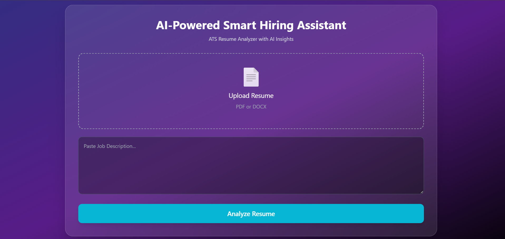
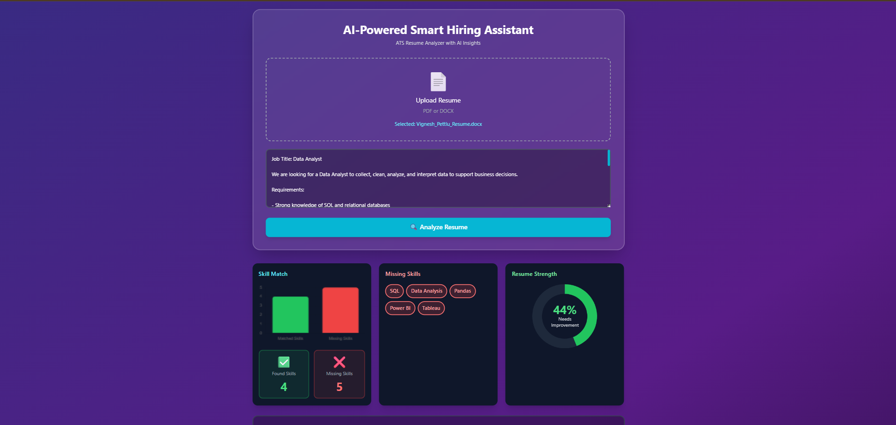
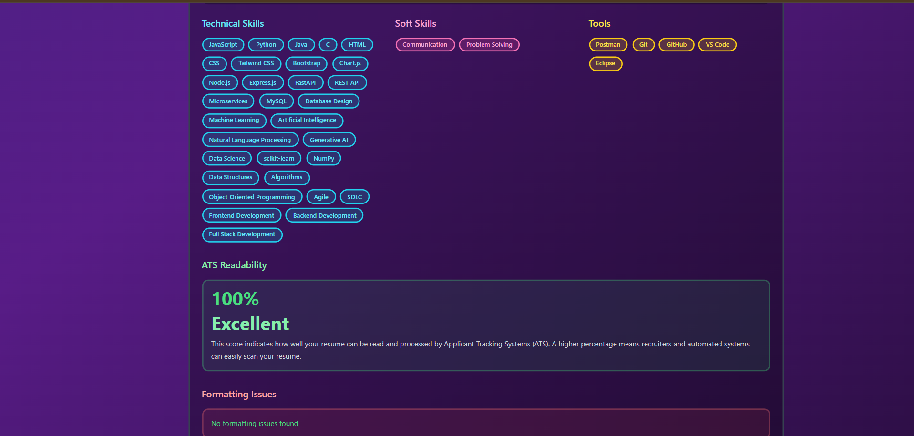
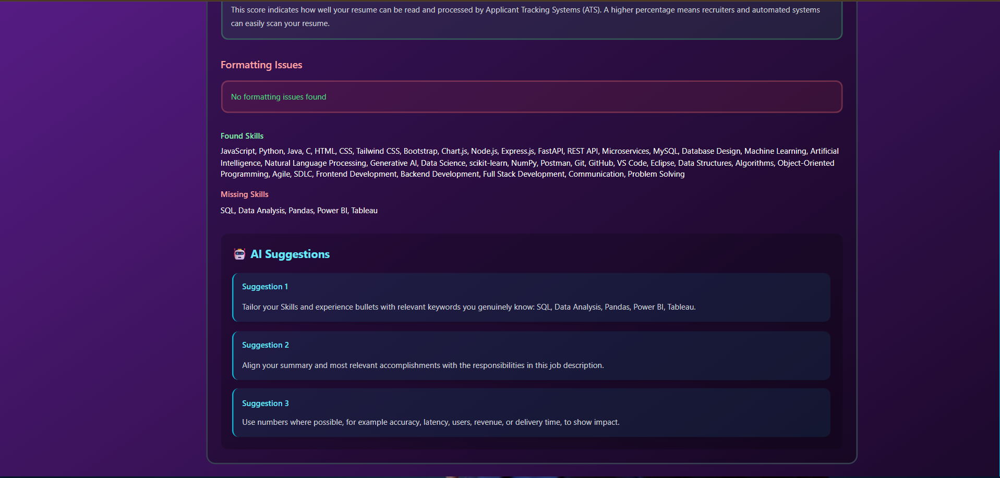
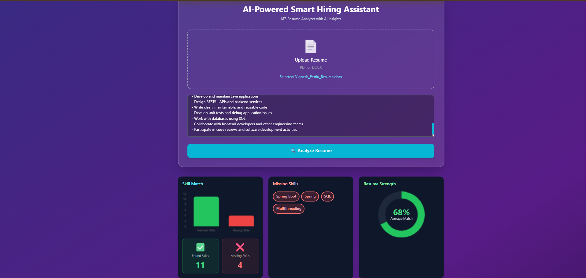

# 🤖 AI-Powered Smart Hiring Assistant

### ATS Resume Analyzer with AI Insights

An AI-powered web application that analyzes resumes against specific job descriptions, calculates ATS compatibility, identifies matching and missing skills, evaluates resume readability, and provides actionable improvement suggestions.

## 🚀 Live Demo

👉 https://resume-analyzer-ai-i9ft.onrender.com/

## 📂 Source Code

👉 https://github.com/Vignesh-130/Resume-Analyzer-AI

---

## ✨ Features

* 📄 Upload resumes in PDF and DOCX formats
* 🎯 Analyze resumes against a specific Job Description
* 📊 Job-dependent ATS Match Score
* 📈 Resume Readability / Strength Score
* 🔍 Identify matching and missing skills
* 🧠 Categorize technical, soft, and tool skills
* ⚠️ Detect resume formatting and ATS readability issues
* 🤖 AI-powered improvement suggestions using Groq
* 📊 Interactive charts using Chart.js
* 🔒 Environment-based API key configuration
* 🌐 Live deployment using Render

---

## 📸 Application Screenshots

### 🏠 Dashboard



### 📊 ATS Analysis Results



### 🧠 Skills Analysis



### 🤖 AI-Powered Suggestions



### 🎯 Score Analysis



---

## 🎯 Project Overview

The AI-Powered Smart Hiring Assistant is designed to help job seekers understand how well their resume matches a specific job description.

Unlike a fixed resume scoring system, the application separates **resume quality** from **job-specific compatibility**.

The same resume can receive different ATS Match Scores when evaluated against different job descriptions.

### Example

```text
Resume + Java Full Stack JD
          ↓
      ATS Match Score
          ↓
Resume + Python Developer JD
          ↓
      Different Score
```

---

## ✨ Key Features

### 📄 Resume Analysis

The application accepts resumes in PDF and DOCX formats and extracts relevant content for analysis.

### 🎯 Job-Specific ATS Matching

The system compares the uploaded resume with a specific job description instead of generating a fixed score.

This allows the same resume to be evaluated differently for different job roles.

### 📊 ATS Match Score

The application generates a job-dependent ATS Match Score based on the relevance between the resume and the provided job description.

### 📈 Resume Strength and Readability

The system evaluates resume quality and provides a separate Resume Strength / Readability Score to identify potential areas for improvement.

### 🔍 Matching and Missing Skills

The application identifies skills that match the job description and highlights important skills that may be missing from the resume.

### 🧠 Skill Categorization

Skills are organized into categories such as:

* Technical Skills
* Soft Skills
* Tools and Technologies

### ⚠️ ATS Readability Analysis

The application identifies potential resume formatting and readability issues that could affect ATS processing.

### 🤖 AI-Powered Suggestions

The application uses Groq-powered AI to generate actionable suggestions for improving resume content and alignment with the target job.

### 📊 Interactive Visualizations

Chart.js is used to present analysis results through interactive charts and visual representations.

---

## 🛠️ Tech Stack

### Frontend

* HTML5
* CSS3
* JavaScript
* Tailwind CSS
* Chart.js

### Backend

* Node.js
* Express.js
* Multer
* Axios
* CORS

### AI / Machine Learning

* Python
* FastAPI
* Sentence Transformers
* `all-MiniLM-L6-v2`
* Cosine Similarity
* Natural Language Processing
* Groq API

### Document Processing

* PDF Parsing
* DOCX Processing
* `pdf-parse`
* `mammoth`

### Deployment

* Render
* GitHub

---

## 🏗️ System Architecture

The application follows a client-server architecture consisting of a web frontend, Node.js backend, and Python-based AI analysis service.

```text
                         ┌──────────────────────┐
                         │    User / Recruiter  │
                         └──────────┬───────────┘
                                    │
                                    ▼
                         ┌──────────────────────┐
                         │    Web Dashboard     │
                         │ HTML / CSS / JS       │
                         │ Tailwind CSS / Charts │
                         └──────────┬───────────┘
                                    │
                         Resume + Job Description
                                    │
                                    ▼
                         ┌──────────────────────┐
                         │    Node.js Backend   │
                         │      Express.js      │
                         └──────────┬───────────┘
                                    │
                       ┌────────────┴────────────┐
                       │                         │
                       ▼                         ▼
             ┌──────────────────┐     ┌──────────────────┐
             │ Document         │     │  FastAPI AI      │
             │ Processing       │     │  Analysis Service │
             │ PDF / DOCX       │     │     Python       │
             └────────┬─────────┘     └────────┬─────────┘
                      │                        │
                      │                        ▼
                      │              ┌────────────────────┐
                      │              │ Sentence Transformer│
                      │              │  all-MiniLM-L6-v2  │
                      │              └─────────┬──────────┘
                      │                        │
                      │                        ▼
                      │              ┌────────────────────┐
                      │              │ Semantic Similarity│
                      │              │  Cosine Similarity │
                      │              └─────────┬──────────┘
                      │                        │
                      └────────────┬───────────┘
                                   ▼
                         ┌──────────────────────┐
                         │   Analysis Results   │
                         │                      │
                         │ • ATS Match Score    │
                         │ • Resume Strength    │
                         │ • Matching Skills    │
                         │ • Missing Skills     │
                         │ • ATS Issues         │
                         │ • AI Suggestions     │
                         └──────────┬───────────┘
                                    │
                                    ▼
                         ┌──────────────────────┐
                         │ Interactive Results  │
                         │ Dashboard & Charts   │
                         └──────────────────────┘
```

---

## 🔄 How It Works

### Step 1 — Resume Upload

The user uploads a resume in PDF or DOCX format.

### Step 2 — Job Description

The user provides the job description for the position they are targeting.

### Step 3 — Document Processing

The backend extracts text from the uploaded resume and prepares it for analysis.

### Step 4 — Semantic Analysis

The resume and job description are processed using the Sentence Transformer model `all-MiniLM-L6-v2`.

The generated embeddings are compared using cosine similarity to determine semantic relevance.

### Step 5 — Skill Analysis

The application identifies relevant skills, matching skills, and potentially missing skills based on the target job description.

### Step 6 — ATS Analysis

The system evaluates the resume for job-specific compatibility and potential ATS readability issues.

### Step 7 — AI Suggestions

Groq-powered AI generates actionable recommendations to improve the resume and better align it with the target position.

### Step 8 — Results Dashboard

The final analysis is presented through scores, charts, skill categories, ATS issues, and AI-generated recommendations.

---

## ⚙️ Setup and Installation

### Prerequisites

Make sure the following are installed:

* Node.js
* npm
* Python 3.x
* Git
* Modern Web Browser

### 1. Clone the Repository

```bash
git clone https://github.com/Vignesh-130/Resume-Analyzer-AI.git
cd Resume-Analyzer-AI
```

### 2. Install Node.js Dependencies

```bash
npm install
```

### 3. Create Python Virtual Environment

```bash
python -m venv venv
```

Activate the environment on Windows:

```bash
venv\Scripts\activate
```

### 4. Install Python Dependencies

```bash
pip install fastapi uvicorn sentence-transformers python-multipart
```

If your project contains a `requirements.txt` file, use:

```bash
pip install -r requirements.txt
```

### 5. Configure Environment Variables

Create a `.env` file in the project root:

```env
GROQ_API_KEY=your_groq_api_key
```

Replace `your_groq_api_key` with your actual Groq API key.

> ⚠️ **Security:** Never upload your `.env` file or expose your API key on GitHub.

Make sure `.env` is included in `.gitignore`.

### 6. Start the AI Analysis Server

Open a terminal and run:

```bash
python ai_server.py
```

The FastAPI service runs on:

```text
http://127.0.0.1:8000
```

### 7. Start the Node.js Server

Open another terminal in the project directory:

```bash
node server.js
```

The Node.js server runs on:

```text
http://localhost:5000
```

### 8. Open the Application

Open your browser and visit:

```text
http://localhost:5000
```

Upload a resume, enter the target job description, and start the ATS analysis.

---

## 📂 Project Structure

```text
Resume-Analyzer-AI/
│
├── public/
│   ├── index.html
│   ├── style.css
│   └── script.js
│
├── screenshots/
│   ├── dashboard.png
│   ├── ats-results.png
│   ├── skills-analysis.png
│   ├── ai-suggestions.png
│   └── score-analysis.png
│
├── uploads/
├── match_score/
│
├── ai_server.py
├── server.js
├── package.json
├── package-lock.json
├── .gitignore
└── README.md
```

> **Note:** The `.env` file should remain local and must not be committed to GitHub.

---

## 🔐 Environment Variables

The application uses environment variables to protect sensitive API credentials.

| Variable       | Purpose                                            |
| -------------- | -------------------------------------------------- |
| `GROQ_API_KEY` | Used for AI-powered resume improvement suggestions |

Never commit API keys, passwords, or other sensitive credentials to the repository.

---

## 🌐 Deployment

The application is deployed using **Render**.

### Production Application

👉 https://resume-analyzer-ai-i9ft.onrender.com/

The deployment uses environment variables for securely configuring the required API credentials.

---

## 🚀 Future Enhancements

* 🔐 User authentication and secure login
* 📚 Resume history and analysis tracking
* 📊 Advanced analytics dashboard
* ☁️ Improved cloud deployment
* 🌐 Production HTTPS support
* 🤖 More advanced generative AI recommendations
* 📄 AI-assisted resume improvement and generation
* 🎯 Job recommendations based on resume skills
* 📈 Resume version comparison and progress tracking

---

## 🎓 Project Highlights

This project demonstrates practical implementation of:

* Full-stack web development
* REST API integration
* Python-based AI services
* Natural Language Processing
* Semantic similarity
* Resume and job-description analysis
* AI-powered recommendations
* Data visualization
* API security using environment variables
* Cloud deployment

---

## 👨‍💻 Author

**Pettlu Vignesh**

B.Tech Computer Science and Engineering
Chadalawada Ramanamma Engineering College

### 🔗 Connect With Me

* GitHub: https://github.com/Vignesh-130
* Live Project: https://resume-analyzer-ai-i9ft.onrender.com/
